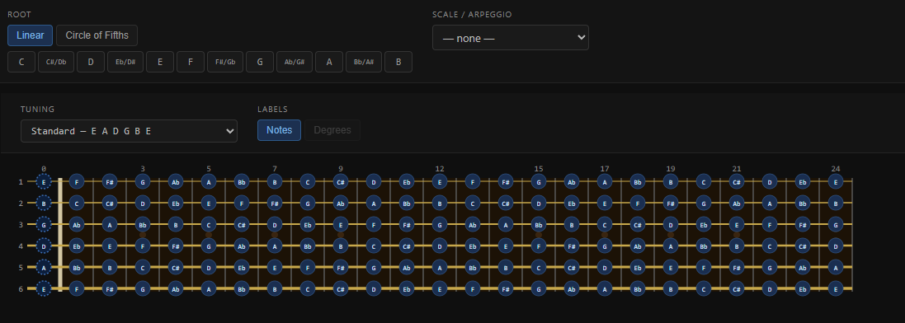
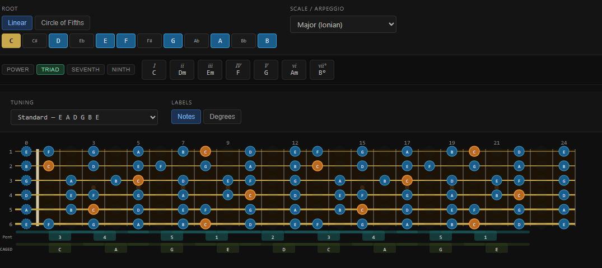
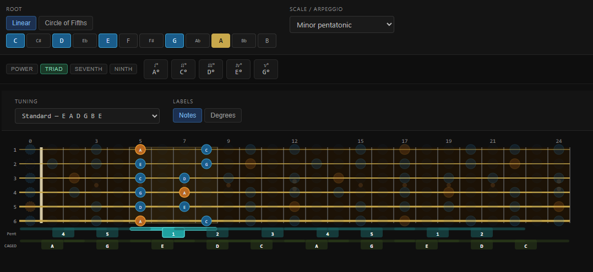
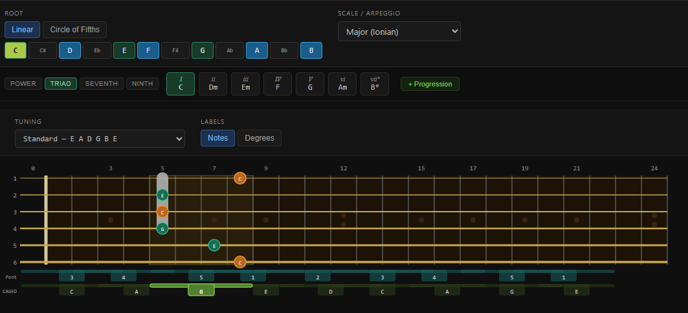
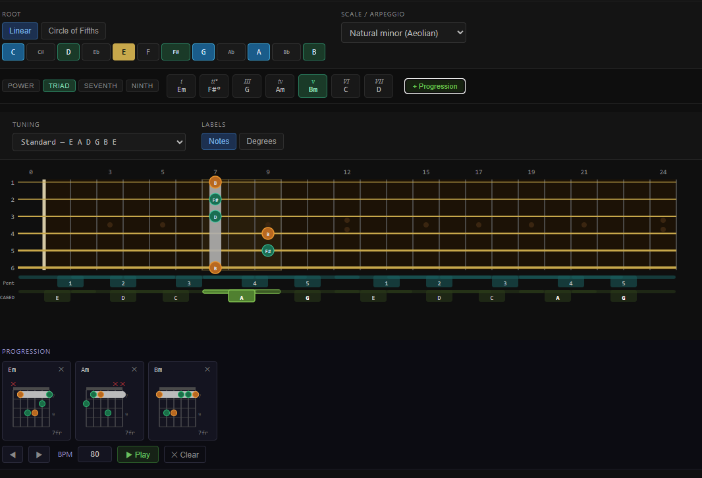

# The Fret

An interactive visual guide to the guitar fretboard.

[](https://github.com/rusanu/the-fret/actions/workflows/deploy.yml)

**Live:** https://rusanu.com/the-fret/

---

## What it does

- Visualises notes on the guitar neck for the given tuning
- Highlights any scale, mode, or arpeggio across the entire neck
- Filters the view to a named fret region (pentatonic boxes 1–5, CAGED scale positions)
- Finds voicing of selected chord in the desired region
- Saves voicing(s) in a chord progression
- Saves snapshots of the current neck view for side-by-side comparison

## How to use



Initial fretboard view shows all notes in the chosen tuning.



Once a key is selected by picking a root and a scale/mode, the fretboard shows only notes in that scale as well as the relevant regions (pentatonic, CAGED) for the selected key. A chord selector appears. You can select the chord type (Power 1-5, Triad 1-3-5, Seventh 1-3-5-7 or Ninth 1-3-5-7-9) and the desired chord (I, II, III etc).



Click on a region label (below the fret) to filter the displayed notes to only that region. Example is the all too familiar Minor Pentatonic A Box 1.



Click on a chord to see a possible voicing/fingering. If a region (CAGED or pentatonic) is selected the voicing/fingering will be restricted to that region. The image above shows C chord in G region (ie. a G shaped C chord). If no region is selected the voicing/fingering will use frets 0-4. Clicking on a different region will revoice the chord in the new region.



You can save a voicing/fingering in a progression. The image above shows the I-IV-V progression in E minor key restricted to CAGED region A (frets 7-9 for Em). To do this you select the key (E Natural minor), then select the target region where you want to play, and then select the chords I and add to progression, then IV, then V.

## Voicings

Note that the app does not know any chord shape. The voicing/fingering are algorithmically constructed so take the results with a grain of salt. [voicing.ts](src\app\core\voicing.ts) contains the relevant logic. It favors voicings that have the chord root on the lowest string in the fingering. It favors voicings with more strings vs. few strings. It does not allow muted strings in the middle of the grip, all muted strings have to be above or below the grip. If there are muted strings both above and below the fretted strings, the above should be only string 6 muted with thumb. Index finger can barre multiple strings. If it cannot find a voicing for a chord it will just highlight the notes of the chord in the region.
With these rules in place it produces the expected results for the familiar open chords as well for all the CAGED region simple triads.

## Chords

The chords picker is simply applying the selection rules as-is. Eg. Triad 1-3-5: take first, 3rd and 5th note in scale, irrelevant of what scale/mode is selected. For 7 note scales/modes this works as expected, but when applied to 5 or 6 note scales, or even to 3 or 4 note arpeggios, the resulting "chords" may or may not have any musical usefulness.

## Tunings

Non-standard tunings are possible, but the results may or may not work. The rules used for finding CAGED region roots or for voicing chords/fingering grips are the same as for standard tuning.


## Development

```bash
npm install
ng serve        # dev server at http://localhost:4200
ng build        # production build
```

## Stack

Angular 20 · standalone components · SVG rendering · no backend
